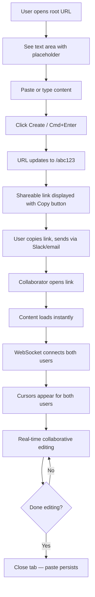
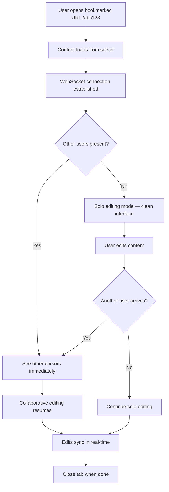
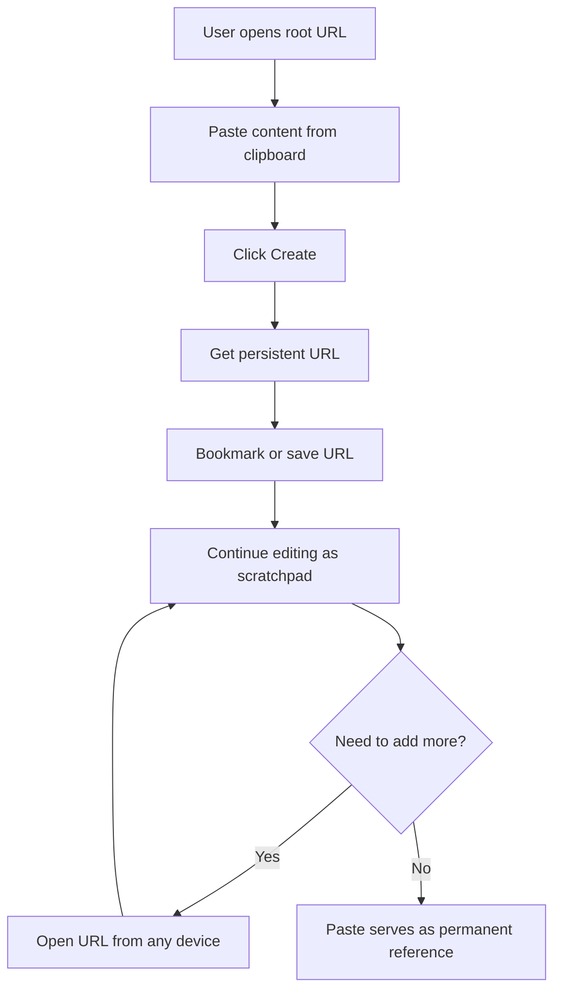

---
stepsCompleted:
  - step-01-init
  - step-02-discovery
  - step-03-core-experience
  - step-04-emotional-response
  - step-05-inspiration
  - step-06-design-system
  - step-07-defining-experience
  - step-08-visual-foundation
  - step-09-design-directions
  - step-10-user-journeys
  - step-11-component-strategy
  - step-12-ux-patterns
  - step-13-responsive-accessibility
  - step-14-complete
inputDocuments:
  - _bmad-output/planning-artifacts/prd.md
lastStep: 14
---

# UX Design Specification - pastebin

**Author:** Gabriele
**Date:** 2026-03-16

---

## Executive Summary

### Project Vision

Pastebin is a zero-friction text sharing and real-time collaboration tool. The UX philosophy is radical simplicity: paste text, get a link, collaborate live — no accounts, no setup, no learning curve. The product targets the gap between static sharing tools (Pastebin, Gists) and heavyweight collaboration suites (Google Docs, Notion), serving teams that value speed and directness over features. The interface should feel as instant as a clipboard operation, with real-time collaboration emerging naturally when multiple people are present.

### Target Users

Technical team members (developers, DevOps engineers) working in fast-paced environments where sharing text snippets is a daily necessity. These users are frustrated by the complexity of existing tools — they don't want to create accounts, navigate menus, or configure sharing settings just to show someone 30 lines of config. They are comfortable with minimal interfaces and value speed, reliability, and persistence over polish. Desktop is the primary context, but paste links opened on mobile must be cleanly readable.

### Key Design Challenges

1. **Zero learning curve** — The entire product must be understood within 3 seconds of landing on it. No onboarding, no instructions. The interface is the explanation.
2. **Seamless solo-to-collaborative transition** — A paste silently upgrades from a solo document to a shared workspace when others arrive, with no mode switches or interruptions.
3. **Invisible reconnection** — Dropped connections and stale sessions must resolve seamlessly, maintaining user trust that their content is safe and current.

### Design Opportunities

1. **Radical simplicity as differentiator** — The deliberate absence of features creates a product that feels faster and more focused than anything else in the category.
2. **Trust through subtle transparency** — Minimal presence indicators (cursors, connection state) make collaboration feel alive without adding visual noise.
3. **Word-of-mouth UX moments** — The first time two people are editing a paste within seconds of sharing a link, the simplicity should feel almost magical — that's the moment that drives adoption.

## Core User Experience

### Defining Experience

The core experience of pastebin is the act of **pasting text and instantly having a shareable link**. This is the atomic interaction — everything else builds on it. The critical moment is the transition from solo paste to live collaboration: when a second person opens the link and both users see each other's cursors, the product's unique value crystallizes. This transition must be invisible — no prompts, no mode changes, no loading screens. The 30-second benchmark (paste, share, collaborate) is the north star for the entire UX.

### Platform Strategy

- **Primary platform:** Web SPA, desktop browsers (Chrome, Firefox, Safari, Edge — latest 2 versions)
- **Input model:** Mouse and keyboard primary. Keyboard shortcuts for power users (e.g., create paste, copy link)
- **Mobile strategy:** Read-friendly viewing when opening paste links on phone (from Slack, email, etc.). Editing on mobile is not a priority
- **Offline:** Always-online is acceptable. Real-time collaboration is the core value, which inherently requires connectivity. Reconnection handling ensures no edits are lost during transient drops
- **Bundle philosophy:** Lightweight and fast-loading, matching the product's simplicity ethos

### Effortless Interactions

1. **Landing → understanding** — A user arriving at the root URL immediately sees a text area and knows what to do. Zero cognitive load.
2. **Paste → link** — Creating a paste and getting a shareable link is a single fluid action. The link appears without navigating away or hunting through menus.
3. **Link → content** — Opening a shared link renders the paste content instantly. No splash screens, no loading gates.
4. **Solo → collaborative** — When a second person joins, cursors appear naturally. No join notifications, no permission dialogs. Collaboration is ambient, not ceremonial.
5. **Disconnect → reconnect** — If a connection drops, the system recovers silently. The user never needs to refresh, re-enter, or wonder if their edits were lost.

### Critical Success Moments

1. **The "aha" moment** — The first time a user shares a link and sees another cursor appear. This is where the product proves it's more than a basic pastebin. If this feels magical, adoption follows.
2. **The trust moment** — When a user returns to a bookmarked paste days or weeks later and it loads exactly as they left it. This builds the habit of using pastebin as a durable reference tool.
3. **The speed moment** — When creating a paste feels faster than opening a Google Doc or formatting a Slack snippet. If the user ever thinks "I should just use pastebin for this," the product has won.
4. **The make-or-break failure** — If concurrent edits cause data loss, duplicate content, or visible glitches, trust is destroyed instantly. Real-time sync must be rock-solid.

### Experience Principles

1. **Instant clarity** — The interface explains itself. No labels needed, no onboarding. You see a text area, you paste, you're done.
2. **Friction is the enemy** — Every interaction costs zero effort. Create in one action, share in one click, collaborate by simply being there.
3. **Collaboration is ambient** — Not a mode you enter, but something that emerges when two people are on the same paste. Cursors appear, edits flow — no announcements, no permissions.
4. **Trust through quietness** — The product earns trust by being reliable and unobtrusive. Connection state, save status, presence — communicated through subtle cues, never interruptions.

## Desired Emotional Response

### Primary Emotional Goals

1. **Effortlessness** — The dominant feeling should be "that took zero effort." Users should never feel like they're wrestling with the tool. The product dissolves into the background, leaving only the task itself.
2. **Confidence** — From the first second, users feel "I know exactly what to do." No hesitation, no second-guessing. The interface communicates its purpose so clearly that confidence is immediate and sustained.
3. **Trust** — "My content is safe here." Users believe their pastes persist, their edits are saved, and the system won't fail them. Trust is earned through consistent, silent reliability.

### Emotional Journey Mapping

| Stage | Desired Feeling | What Drives It |
|---|---|---|
| **First landing** | Clarity and relief — "finally, something simple" | Minimal interface, obvious text area, no sign-up wall |
| **Creating a paste** | Speed and satisfaction — "that was instant" | One action from text to shareable link, no waiting |
| **Sharing the link** | Anticipation — "this is going to just work" | Clean URL, no extra steps to configure sharing |
| **Collaborator arrives** | Quiet delight — "of course it works this way" | Cursor appears naturally, no fanfare, no friction |
| **Active collaboration** | Calm focus — "we're both here, working together" | Smooth real-time sync, no lag, no visual clutter |
| **Returning later** | Trust confirmed — "it's exactly as I left it" | Instant load, content intact, same URL |
| **Connection trouble** | Reassurance — "it'll sort itself out" | Silent reconnection, no panic-inducing error states |

### Micro-Emotions

- **Confidence over confusion** — The user never wonders "what do I do now?" Every state of the product has an obvious next action.
- **Trust over skepticism** — The user never wonders "did it save?" or "is my edit lost?" Subtle indicators confirm that the system is working.
- **Calm focus over overwhelm** — Nothing competes for attention. No toolbars, no notifications, no feature menus. The text is the entire experience.
- **Quiet delight over loud surprise** — The collaborative moments feel like a pleasant discovery, not a fireworks show. The reaction is a smile, not a gasp.

### Design Implications

- **Effortlessness → minimal UI chrome** — Every pixel that isn't content or a primary action is noise. Strip everything that doesn't directly serve the core experience.
- **Confidence → self-evident interface** — The text area, the create button, the share link — each element's purpose must be obvious from shape and placement alone, not from labels or instructions.
- **Trust → invisible persistence** — No "save" button. No "saved!" toast. Content is always saved. Connection status shown as a subtle indicator (e.g., a small dot) — present for those who look, invisible to those who don't.
- **Calm focus → muted visual language** — Soft colors, generous whitespace, no animations that demand attention. Collaborator cursors are visible but not distracting — thin lines with subtle color differentiation.
- **Quiet delight → ambient collaboration** — The appearance of a collaborator's cursor should feel natural and expected, not announced. No "User joined!" banners. The presence simply *is*.

### Emotional Design Principles

1. **Silence is trust** — The product communicates reliability through what it *doesn't* say. No confirmation dialogs, no success banners, no "are you sure?" prompts. Things just work.
2. **Subtlety is delight** — The moments of magic (a cursor appearing, edits flowing in real time) are understated. Delight comes from how natural it feels, not from how loudly it's announced.
3. **Absence is clarity** — Every element removed from the interface adds emotional clarity. The user's attention belongs to their content, not to the product's UI.
4. **Consistency is comfort** — The product behaves the same way every time. No surprises, no edge cases that feel different. Predictability builds the emotional foundation of trust.

## UX Pattern Analysis & Inspiration

### Inspiring Products Analysis

**1. GitHub Gist**
- **What it does well:** Instant text sharing with a URL. No friction to create.
- **Where it falls short:** Static — no collaboration. Requires a GitHub account. The interface carries GitHub's full navigation overhead.
- **Lesson for pastebin:** Steal the simplicity of "paste and get a link" but strip away everything else. No account wall, no navigation chrome.

**2. Google Docs**
- **What it does well:** Gold standard for real-time collaboration. Cursor presence, live sync, and conflict resolution are seamless.
- **Where it falls short:** Heavy. Requires a Google account. Loading time alone defeats the purpose of quick sharing. The toolbar is overwhelming for a simple text task.
- **Lesson for pastebin:** The collaboration mechanics are the benchmark — but wrapped in an interface that's 95% lighter. Prove that real-time editing doesn't need a productivity suite.

**3. Excalidraw**
- **What it does well:** Instant collaborative whiteboard. No login required. Share a link, start drawing together. The interface is minimal and the collaboration feels magical.
- **Where it falls short:** Purpose-built for drawing, not text.
- **Lesson for pastebin:** This is the closest spiritual ancestor. The "open a link, immediately collaborate" pattern is exactly what we're building for text. Excalidraw proves that zero-auth collaboration creates powerful word-of-mouth adoption.

### Transferable UX Patterns

**Interaction Patterns:**
- **Excalidraw's instant collaboration** — No login, no setup. Open a link, you're in. This is the gold standard for zero-friction collaborative tools.
- **Google Docs' cursor presence** — Colored cursors with subtle labels. Presence is visible but never intrusive. Adapted for our simpler context: thin colored cursors, no user labels in MVP.

**Navigation Patterns:**
- **Single-screen architecture** — No navigation needed. The entire app is one screen: an editor. This eliminates the most common source of UX complexity.
- **URL-as-state** — The paste URL *is* the navigation. Root URL = create. Paste URL = view/edit. No routing complexity, no breadcrumbs.

**Visual Patterns:**
- **Excalidraw's whitespace-forward design** — The canvas dominates. UI controls are peripheral, minimal, and contextual.
- **iA Writer's focused editing** — A text editor that removes everything except the text. Typography-first, distraction-free.

### Anti-Patterns to Avoid

- **Feature creep on the editor** — Resist adding formatting toolbars, syntax highlighting toggles, or mode selectors in MVP. Every button is a decision the user has to process.
- **Confirmation dialogs** — "Are you sure you want to create this paste?" defeats the purpose. Actions should be immediate and reversible, not gated.
- **Onboarding tours** — If the product needs an onboarding tour, the product is too complex. The interface should be self-explanatory.
- **Loading spinners on primary actions** — Paste creation should feel instant. If a spinner appears, the perceived speed is ruined even if the actual wait is under a second.

### Design Inspiration Strategy

**What to Adopt:**
- Excalidraw's zero-auth collaboration model — link sharing with instant access
- Google Docs' cursor presence mechanics — adapted for simplicity
- iA Writer's focused, typography-first editing experience

**What to Adapt:**
- GitHub Gist's paste-and-share flow — simplified to a single action instead of a form
- Excalidraw's minimal UI chrome — adapted for a text-only context

**What to Avoid:**
- Google Docs' toolbar density and account requirements
- GitHub Gist's static, non-collaborative model
- Any pattern that introduces modes, settings, or configuration

## Design System Foundation

### Design System Choice

**Tailwind CSS** — a utility-first CSS framework with no pre-built component opinions.

### Rationale for Selection

1. **Minimal footprint** — Pastebin's interface is so simple (a text area, a button, a link, cursor indicators) that a full component library (MUI, Ant Design) would be massive overkill. We'd use 3% of the components and ship 100% of the bundle.
2. **Full visual control** — The product's identity is defined by what's *absent*. We need pixel-level control over every element to achieve radical simplicity. Pre-built component libraries impose visual opinions we'd spend time overriding.
3. **Speed of development** — Utility classes allow rapid iteration on the few UI elements we have. No component API to learn, no theme configuration ceremony.
4. **Aligns with product philosophy** — A zero-overhead CSS approach for a zero-overhead product. The tool matches the ethos.

### Implementation Approach

- Use Tailwind utility classes directly in component markup
- Define a small set of design tokens (colors, spacing, typography) in the Tailwind config
- No component library dependency — the ~5 UI elements (text area, button, link display, cursor indicator, status dot) are simple enough to build from primitives
- Purge unused CSS in production for minimal bundle size

### Customization Strategy

- Custom color palette defined in `tailwind.config.js` aligned with the visual foundation below
- Custom font stack configuration for the monospace-forward typography system
- Minimal set of reusable utility compositions for the few repeated patterns (e.g., focus rings, transition timing)

## Detailed Core Experience

### Defining Interaction

**"Paste text, get a link, edit together."** — This is the sentence users would use to describe pastebin to a colleague. It's the product's elevator pitch compressed into the UX itself. Like Tinder's swipe or Snapchat's disappearing photos, the defining interaction is so simple it can be explained in one breath.

### User Mental Model

Users bring two existing mental models to pastebin:

1. **The clipboard** — "I copy something, I paste it somewhere, I share the location." The mental model of a pastebin is fundamentally clipboard-like: put text in, get a reference out.
2. **The shared document** — "I open a link, I see text, I can edit it, others can too." Google Docs has trained users to expect cursor presence and live sync in shared documents.

Pastebin merges these two models: the *speed* of a clipboard operation with the *liveness* of a shared document. The user never has to consciously switch between them — the product transitions seamlessly from one to the other.

**Current workarounds being replaced:**
- Pasting code into Slack (gets lost in threads, no editing, bad formatting)
- Creating throwaway Google Docs (account required, slow to load, overkill)
- Emailing text to self (no collaboration, clutters inbox)
- Using `cat` and SSH to share files between machines (no collaboration, no persistence)

### Success Criteria

1. A first-time user creates a paste and gets a shareable link within 10 seconds of landing on the page
2. A collaborator opens the shared link and sees the content within 2 seconds
3. Both users see each other's cursors and live edits within 1 second of the second user arriving
4. The user never clicks a "save" button — persistence is automatic and invisible
5. A user returning to a bookmarked paste days later finds the content exactly as left

### Novel UX Patterns

The UX uses **entirely established patterns** — text areas, buttons, links, cursors. There is nothing to teach. The innovation is in what's *removed*, not what's added:

- No account creation flow (removed)
- No sharing permissions dialog (removed)
- No save button (removed)
- No collaboration setup (removed)
- No document naming (removed)

The novelty is the absence of friction, not the presence of new interactions.

### Experience Mechanics

**1. Initiation — Creating a Paste:**
- User lands on root URL → sees a large text area with placeholder text ("Paste your text here...")
- User pastes or types content
- User clicks "Create" button (or presses Cmd/Ctrl+Enter)
- System responds within <1 second

**2. Interaction — Getting the Link:**
- After creation, the URL updates to the paste's unique URL (e.g., `/abc123`)
- The shareable link is displayed prominently, with a "Copy" button
- The text area remains editable — the user is now in the live editing state
- A WebSocket connection is established automatically

**3. Feedback — Collaboration State:**
- When alone: No visible collaboration indicators. The interface is clean and solo.
- When others arrive: Colored cursor lines appear at their edit positions. No announcement, no sound.
- Connection status: A tiny dot (green = connected, amber = reconnecting) in a non-intrusive corner position
- Edits from others appear in real time with no flicker or jump

**4. Completion — The Paste Lives On:**
- There is no "done" action. The paste exists at its URL indefinitely.
- Users simply close the tab or navigate away. No "unsaved changes" warning.
- Returning to the URL at any point loads the latest state.

## Visual Design Foundation

### Color System

**Philosophy:** The color system serves the content, not the brand. Colors are used sparingly and functionally — to indicate state, not to decorate.

**Base Palette:**
- **Background:** `#FFFFFF` (white) — clean, paper-like canvas
- **Text:** `#1A1A1A` (near-black) — high contrast, easy reading
- **Muted text:** `#6B7280` (gray-500) — secondary information, placeholders
- **Border:** `#E5E7EB` (gray-200) — subtle structural boundaries
- **Primary action:** `#2563EB` (blue-600) — "Create" button, copy link button
- **Primary hover:** `#1D4ED8` (blue-700) — button hover state

**Semantic Colors:**
- **Connected:** `#22C55E` (green-500) — connection status dot
- **Reconnecting:** `#F59E0B` (amber-500) — connection recovering
- **Disconnected:** `#EF4444` (red-500) — connection lost (rare, only after extended failure)

**Collaborator Cursor Colors** (assigned in order of arrival):
- Cursor 1: `#8B5CF6` (violet-500)
- Cursor 2: `#EC4899` (pink-500)
- Cursor 3: `#F97316` (orange-500)
- Cursor 4: `#14B8A6` (teal-500)
- Cursor 5: `#EAB308` (yellow-500)
- Cursors 6-10: Cycle through palette with reduced opacity

### Typography System

**Philosophy:** Monospace-forward, developer-friendly, but not aggressively technical. The text area uses monospace because the primary content is code and config. UI elements use a clean sans-serif.

**Font Stack:**
- **Editor text:** `'JetBrains Mono', 'Fira Code', 'SF Mono', 'Consolas', monospace` — optimized for code readability
- **UI text:** `'Inter', -apple-system, BlinkMacSystemFont, 'Segoe UI', sans-serif` — clean, neutral, modern

**Type Scale:**
- **Editor text:** 14px / 1.6 line-height — balanced for code readability
- **UI heading (e.g., page title):** 18px / 1.4 — present but not dominant
- **UI body (e.g., button labels):** 14px / 1.5 — matches editor for visual harmony
- **UI small (e.g., status text):** 12px / 1.4 — connection status, timestamps

### Spacing & Layout Foundation

**Philosophy:** Generous whitespace, minimal density. The editor is the entire product — give it maximum screen real estate.

**Spacing Unit:** 4px base, with a scale of 4, 8, 12, 16, 24, 32, 48, 64

**Layout Structure:**
- **Create page (root URL):** Centered text area taking ~70% of viewport width, max 800px. Create button below. Nothing else.
- **Paste page (paste URL):** Full-width editor area with minimal padding (16px). Thin utility bar at top with link display and copy button. Status indicator in corner.
- **No sidebar, no navigation, no footer.** The product is a single screen.

**Grid:** No formal grid system needed. The layout is a single column with centered content on the create page and full-width on the paste page.

### Accessibility Considerations

- All text meets WCAG AA contrast ratios (4.5:1 for body text, 3:1 for large text)
- Collaborator cursor colors chosen for distinguishability across common color vision deficiencies
- Focus indicators use a visible blue ring (2px solid, offset) for keyboard navigation
- Status dot uses shape in addition to color (filled circle = connected, hollow ring = reconnecting) for colorblind users

## Design Direction Decision

### Design Directions Explored

Given pastebin's radical simplicity, the design direction is constrained by the product philosophy itself. Three directions were considered:

1. **"Blank Page"** — Ultra-minimal. White background, black text, a text area, and absolutely nothing else. The create button is the only UI element beyond the editor. Connection status is invisible unless hovered.
2. **"Developer Terminal"** — Dark background, monospace everything, green-on-black aesthetic. Feels like a terminal emulator. Appeals to the developer audience but may feel intimidating to non-technical users.
3. **"Clean Workspace"** — Light, airy, modern. Subtle gray backgrounds, rounded corners, soft shadows. Feels like a contemporary web app (Notion-like) without the complexity. Professional but approachable.

### Chosen Direction

**Direction 3: "Clean Workspace"** — with elements borrowed from Direction 1's restraint.

The interface should feel modern and approachable (not intimidating like a terminal) but with the aggressive minimalism of Direction 1. Specifically:
- Light, clean background with subtle warmth
- Rounded corners and soft shadows for the editor area
- Monospace font for the editor content (developer-friendly) but sans-serif for UI elements
- No dark mode in MVP (can be added in Phase 2)

### Design Rationale

- **General-purpose feel** — The user specified the UX should be general-purpose, not developer-exclusive. A clean workspace aesthetic achieves this while still being comfortable for developers.
- **Readable on mobile** — Light backgrounds with high-contrast text are the most readable on small screens in varied lighting conditions.
- **Emotional alignment** — The "Clean Workspace" direction supports the emotional goals of clarity, confidence, and calm focus. It feels trustworthy without feeling sterile.

### Implementation Approach

- White/light gray background with the defined color palette
- Subtle border or shadow to define the editor area as a contained workspace
- Rounded corners (6px-8px) for interactive elements (buttons, editor container)
- Minimal shadow (0 1px 3px rgba(0,0,0,0.1)) for depth without heaviness
- Transition timing of 150ms for hover/focus states — fast enough to feel responsive, slow enough to feel intentional

## User Journey Flows

### Journey 1: Quick Share to Live Collaboration

**Entry:** User lands on root URL

**Key UX decisions:**
- URL updates in-place after creation (no redirect/new page)
- Copy button provides one-click link sharing
- No "share" dialog — the link IS the sharing mechanism
- Collaboration begins automatically when a second connection opens

### Journey 2: Returning to a Stale Paste

**Entry:** User opens bookmarked paste URL

**Key UX decisions:**
- No "reconnecting..." interstitial. Content loads from persistent storage, then WebSocket connects.
- Stale sessions are handled by CRDT merge — no conflict dialogs ever
- The transition from solo to collaborative is seamless in both directions

### Journey 3: Solo Scratchpad

**Entry:** User creates paste for personal use

**Key UX decisions:**
- A paste works perfectly as a single-user tool — no collaboration UI appears unless someone else joins
- Cross-device access is automatic via the URL
- No concept of "ownership" — anyone with the link can edit (by design)

### Journey Patterns

**Common patterns across all journeys:**
- **URL as the universal entry point** — Every journey starts with a URL (root or paste-specific)
- **Instant content visibility** — Content is always the first thing loaded, within 2 seconds
- **Ambient state transitions** — Solo to collaborative, disconnected to connected — all transitions happen without user action
- **No terminal actions** — There's no "close," "delete," or "finish." The paste simply exists.

### Flow Optimization Principles

1. **Zero-step collaboration** — Collaboration requires no explicit action from either party. Open the link = you're in.
2. **Content-first loading** — Always show content before establishing real-time features. The paste is useful even before WebSocket connects.
3. **Progressive enhancement** — Solo editing works without WebSocket. Collaboration layers on top transparently.
4. **No dead ends** — Every state has an obvious next action or a graceful static state.

## Component Strategy

### Design System Components

Since we're using Tailwind CSS (utility-first, no component library), all components are custom-built. However, the component inventory is intentionally tiny:

**Total unique components needed for MVP: 7**

This extreme simplicity is a feature, not a limitation. Each component is purpose-built for pastebin's specific needs.

### Custom Components

#### 1. PasteEditor
**Purpose:** The primary text editing area — the heart of the entire product.
**Content:** User-entered plain text content, synchronized across all connected clients.
**States:**
- Empty (with placeholder text)
- Active (user is typing)
- Collaborative (multiple cursors visible)
- Reconnecting (subtle indicator, editing continues)
**Behavior:** Full-width text area with monospace font. Integrates with CRDT library for real-time sync. Renders remote cursors as colored vertical lines at insertion points.
**Accessibility:** ARIA role="textbox", aria-multiline="true", aria-label="Paste content editor"

#### 2. CreateButton
**Purpose:** Triggers paste creation from the root URL.
**Content:** "Create" label.
**States:** Default, hover, active (pressed), disabled (empty text area)
**Behavior:** Creates paste on click or Cmd/Ctrl+Enter keyboard shortcut. Disabled state when editor is empty.
**Accessibility:** Keyboard accessible, aria-label="Create paste", disabled state communicated to screen readers.

#### 3. ShareLink
**Purpose:** Displays the paste's shareable URL with a copy-to-clipboard action.
**Content:** The paste URL and a "Copy" button/icon.
**States:** Default (showing URL), copied (brief "Copied!" confirmation)
**Behavior:** Click the copy button → URL copied to clipboard → brief visual confirmation (text changes to "Copied!" for 2 seconds, then reverts). The URL itself is selectable text.
**Accessibility:** aria-label="Shareable paste link", copy button has aria-label="Copy link to clipboard", success state announced to screen readers.

#### 4. CursorIndicator
**Purpose:** Shows remote collaborators' cursor positions in the editor.
**Content:** A thin vertical colored line at the remote user's cursor position.
**States:** Active (user is typing — cursor may flash), idle (cursor is stationary), exiting (fade out when user disconnects)
**Behavior:** Positioned absolutely within the editor at the character offset reported by the CRDT. Color assigned from the collaborator cursor palette. Smooth position transitions (150ms) to avoid jarring jumps.
**Accessibility:** aria-hidden="true" — cursor indicators are purely visual and supplementary.

#### 5. ConnectionStatus
**Purpose:** Communicates WebSocket connection health.
**Content:** A small colored dot.
**States:**
- Connected: green filled dot
- Reconnecting: amber hollow ring (pulsing)
- Disconnected: red filled dot (only after extended failure)
**Behavior:** Positioned in the bottom-right corner. Unobtrusive. Tooltip on hover with text status ("Connected", "Reconnecting...", "Disconnected").
**Accessibility:** aria-live="polite" for state changes, aria-label describing current connection state.

#### 6. PageHeader
**Purpose:** Minimal top bar on the paste view page.
**Content:** ShareLink component, optionally a "New Paste" link back to root.
**States:** Single state — always visible on paste pages.
**Behavior:** Thin, non-sticky. Stays at the top but doesn't consume viewport space when scrolling.
**Accessibility:** Semantic `<header>` element, skip-to-content link for keyboard users.

#### 7. PlaceholderState
**Purpose:** The empty state of the editor on the root URL.
**Content:** Placeholder text like "Paste your text here..." in muted color.
**States:** Visible (editor empty), hidden (editor has content)
**Behavior:** Disappears on first input. Reappears if all content is deleted.
**Accessibility:** Not announced to screen readers (the text area's aria-label serves this purpose).

### Component Implementation Strategy

- All components built with semantic HTML and Tailwind utility classes
- No third-party component dependencies
- CRDT integration (likely Yjs) is an implementation concern within PasteEditor, not a component concern
- Components are simple enough that a formal design system build tool (Storybook) is unnecessary for MVP

### Implementation Roadmap

**Phase 1 — MVP (all 7 components):**
All components are needed for MVP. The total count is so small that phasing isn't necessary.

**Phase 2 — Growth additions:**
- UserBadge (optional username display on cursors)
- PresenceSidebar (list of active collaborators)
- SyntaxHighlighter (code language detection and highlighting)
- VersionHistory (snapshot timeline)

## UX Consistency Patterns

### Button Hierarchy

**Primary buttons** (e.g., "Create"):
- Blue-600 background, white text, rounded-md (6px)
- Hover: Blue-700 background
- Focus: Blue ring (2px, offset 2px)
- Disabled: Gray-300 background, gray-500 text, not clickable

**Secondary buttons** (e.g., "Copy"):
- Transparent background, blue-600 text, subtle border
- Hover: Light blue background tint
- Focus: Same blue ring as primary

**Tertiary/link actions** (e.g., "New Paste"):
- No background, no border, blue-600 text with underline on hover
- Used for navigation, not for primary actions

### Feedback Patterns

**Success feedback:**
- Inline text change (e.g., "Copy" → "Copied!") that auto-reverts after 2 seconds
- No toast notifications, no modals, no banners
- Color change to green-600 during confirmation

**Connection state feedback:**
- Status dot in corner (green/amber/red) — always visible but unobtrusive
- Tooltip on hover provides text description
- No modal alerts for connection state changes
- If disconnected for >30 seconds, a subtle inline message appears below the header: "Reconnecting..." in muted text

**Error feedback:**
- Errors are rare by design (no forms, no validation, no permissions)
- If paste creation fails: Button text changes to "Retry" with a muted error message below
- If paste URL is invalid (404): Simple centered message "Paste not found" with a link back to create a new one

### Form Patterns

**Pastebin has essentially no forms.** The entire input model is:
- A text area (the editor)
- A button (Create)

No labels, no validation messages, no required field indicators. The text area accepts any text. The button is disabled when the text area is empty. That's the extent of form UX.

### Navigation Patterns

**URL-based navigation only:**
- `/` — Create page (text area + Create button)
- `/{pasteId}` — Paste page (editor + share link + status)

**No navigation menu, no sidebar, no tabs, no breadcrumbs.** The only navigation element is a "New Paste" link on the paste page that returns to the root URL.

**Browser back/forward** works naturally because each paste has its own URL.

### Additional Patterns

**Loading states:**
- Paste page: Show the editor container immediately with a subtle shimmer/skeleton on the text content area. Content appears once loaded (within 2 seconds). No full-page spinner.
- Never block the entire viewport with a loading state.

**Empty states:**
- Root URL: Placeholder text in the editor — "Paste your text here..." in gray-400
- No elaborate empty state illustrations or messaging

**Keyboard shortcuts:**
- `Cmd/Ctrl + Enter` — Create paste (on root URL)
- `Cmd/Ctrl + Shift + C` — Copy paste link (on paste page)
- Standard text editing shortcuts work naturally in the editor

## Responsive Design & Accessibility

### Responsive Strategy

**Desktop (primary — 1024px+):**
- Full experience. Editor takes maximum width (max 900px, centered on create page; full-width on paste page)
- Generous padding and whitespace
- All interactive features available
- Keyboard shortcuts active

**Tablet (768px - 1023px):**
- Same layout as desktop, slightly reduced padding
- Touch targets enlarged to 44px minimum
- All features available
- Keyboard shortcuts available when keyboard connected

**Mobile (320px - 767px):**
- Read-optimized. Content is fully readable with appropriate font sizing
- Editor is full-width with minimal padding (8px-12px)
- "Create" button full-width below editor
- "Copy" link button prominently sized for thumb targeting
- Editing is possible but not optimized — acceptable trade-off per PRD
- Cursor indicators for collaborators are visible but simplified

### Breakpoint Strategy

| Breakpoint | Width | Approach |
|---|---|---|
| Mobile | 320px - 767px | Stack layout, full-width elements, larger touch targets |
| Tablet | 768px - 1023px | Centered layout with moderate padding, touch-optimized |
| Desktop | 1024px+ | Centered create page (max 800px), generous whitespace |

**Desktop-first** CSS approach (matching primary use case), with responsive overrides for smaller screens.

### Accessibility Strategy

**Target:** WCAG 2.1 Level AA compliance.

**Rationale:** The PRD states "no accessibility targets," but basic AA compliance is achievable with almost zero effort given the product's simplicity — and it's the right thing to do. The interface is so minimal that most AA requirements are met by default.

**Key requirements:**
- **Color contrast:** All text meets 4.5:1 ratio against backgrounds (verified in color system above)
- **Keyboard navigation:** Full keyboard access to all interactive elements (Create button, Copy button, New Paste link, editor)
- **Focus indicators:** Visible focus rings on all interactive elements
- **Screen reader support:** Semantic HTML (`<main>`, `<header>`, `<textarea>`), ARIA labels on interactive elements, live regions for connection status changes
- **Touch targets:** Minimum 44x44px on mobile for all interactive elements
- **Reduced motion:** Respect `prefers-reduced-motion` for cursor transitions and status dot pulse animation

### Testing Strategy

**Responsive testing:**
- Test on Chrome, Firefox, Safari, Edge (latest 2 versions)
- Test on real iOS (Safari) and Android (Chrome) devices for mobile reading
- Verify text readability and touch targets on mobile

**Accessibility testing:**
- Automated: Run axe-core or Lighthouse accessibility audit
- Manual: Keyboard-only navigation test (Tab through all elements)
- Manual: Screen reader test with VoiceOver (macOS/iOS)
- Verify color contrast with WebAIM contrast checker

### Implementation Guidelines

**Responsive development:**
- Use Tailwind's responsive prefixes (`sm:`, `md:`, `lg:`) for breakpoint-specific styles
- Use `rem` units for typography, `px` for borders/shadows, `%` or `vw` for layout widths
- Test touch targets are at least 44x44px on mobile

**Accessibility development:**
- Use semantic HTML elements (`<main>`, `<header>`, `<button>`, `<textarea>`)
- Add `aria-label` to all interactive elements without visible text labels
- Use `aria-live="polite"` on the ConnectionStatus component
- Implement visible focus indicators (don't remove default outline without replacement)
- Add `<a href="#main-content">Skip to content</a>` as first focusable element
- Support `prefers-reduced-motion` media query
